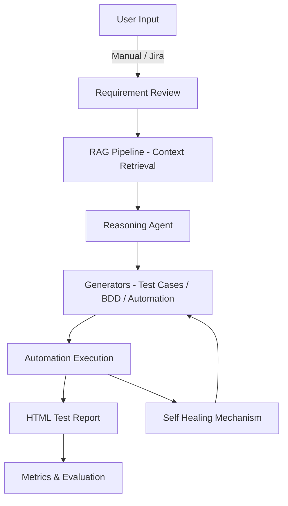

# AI-Agentic QA Assistant

This project is the **Capstone AI Academy Engineers Project from Ciklum AI Academy**.
It implements an **AI-Agentic QA Assistant** capable of reading requirements from **Jira or manual input**, retrieving context from **TXT and PDF documents using a RAG (Retrieval-Augmented Generation) pipeline**, and generating QA automation artifacts.

The system automatically produces:

* Test cases (CSV)
* BDD feature files
* Playwright Python automation scripts
* HTML test reports
* QA metrics
* LinkedIn-style summary posts

The project demonstrates a **complete AI-agentic pipeline combining RAG retrieval, reasoning, tool-calling, and reporting for QA automation.**

---

# Objectives

* Demonstrate an **AI-Agentic QA workflow**
* Apply **RAG-based context retrieval** for requirement understanding
* Automatically generate **QA artifacts (test cases, BDD, automation)**
* Perform **AI self-reflection and reasoning**
* Produce **engineering metrics and automated reporting**
* Demonstrate **AI-driven test generation and execution**

---

# Key Features

* AI-Agentic QA workflow
* RAG-based requirement understanding
* Automatic test case generation
* BDD scenario generation
* Playwright automation script generation
* Self-reflection and requirement validation
* Automated metrics generation
* LinkedIn-style reporting
* CI-ready automation execution

---

# Project Structure

```
AI-Agentic-QA-Assistant/
│
├── app.py
│
├── agents/
│   └── qa_agent.py
│
├── generators/
│   ├── automation_generator.py
│   ├── rag_pipeline.py
│   ├── testcase_generator.py
│   ├── bdd_generator.py
│   ├── requirement_reviewer.py
│   ├── post_generator.py
│   └── metrics_generator.py
│
├── capstone_data/
│   └── docs/
│       ├── requirement_doc.txt
│       └── project_guidelines.pdf
│
├── output/
├── venv/
├── architecture.mmd
└── README.md
```

---

# Module Descriptions

### qa_agent.py

Coordinates the overall AI QA workflow.
It invokes reasoning, tool-calling, and self-reflection loops and acts as the central **agent controlling test generation and evaluation.**

### automation_generator.py

Generates **Playwright automation scripts** from BDD scenarios or test cases and supports optional **self-healing for minor UI changes**.

### bdd_generator.py

Converts requirements into **Gherkin-style BDD scenarios**, ensuring coverage of edge cases and negative scenarios.

### data_loader.py

Loads and preprocesses **TXT, PDF, and Word documents** for the RAG pipeline and performs document chunking.

### metrics_generator.py

Calculates metrics such as:

* Number of generated test cases
* Number of BDD scenarios
* Coverage insights
* Self-healing usage

### post_generator.py

Generates a **LinkedIn-style summary post** describing the automation outputs and project impact.

### rag_pipeline.py

Implements **Retrieval-Augmented Generation**:

* Splits documents into chunks
* Creates embeddings
* Stores embeddings in **ChromaDB**
* Retrieves relevant context for AI reasoning

### requirement_reviewer.py

Analyzes requirements for **gaps, risks, and missing validations**, acting like an **AI senior QA reviewer**.

### testcase_generator.py

Generates structured **CSV test cases** covering positive, negative, and edge scenarios.

### app.py

Main project entrypoint.
Handles user input, initializes the RAG pipeline, triggers agents, and stores generated outputs.

---

# Dependencies

Create and activate a Python virtual environment.

```
python -m venv venv
```

### Windows

```
venv\Scripts\activate
```

### macOS / Linux

```
source venv/bin/activate
```

Upgrade pip and install dependencies:

```
pip install --upgrade pip
pip install openai langchain langchain-community chromadb pytest pytest-html playwright python-dotenv beautifulsoup4
```

Install Playwright browsers:

```
playwright install
```

---

# Environment Variables

Create a `.env` file in the project root.

```
OPENAI_API_KEY=your_openai_api_key_here
HEADLESS=False
```

Never commit your real API key to the repository.

---

# Usage

Prepare documents inside:

```
capstone_data/docs/
```

Example files:

* `requirement_doc.txt` – Requirement examples and QA scenarios
* `project_guidelines.pdf` – QA standards and coding guidelines

Run the project:

```
python app.py
```

Choose input type:

| Option | Description        |
| ------ | ------------------ |
| 1      | Manual Requirement |
| 2      | Fetch Jira Stories |

---

# Generated Outputs

Outputs are stored in:

```
output/<ticket>/
```

| File                | Description                   |
| ------------------- | ----------------------------- |
| test_cases.csv      | Generated test cases          |
| feature.feature     | BDD scenarios                 |
| playwright_tests.py | Playwright automation script  |
| test_report.html    | HTML test execution report    |
| metrics_summary.txt | QA metrics summary            |
| linkedin_post.txt   | AI-generated LinkedIn summary |

---

# Execution Flow

1. Requirement review is performed.
2. Test cases and BDD scenarios are generated.
3. Playwright automation scripts are created.
4. Tests run in headed or headless browser mode.
5. Self-healing resolves minor UI locator changes.
6. Metrics and reports are generated.

---

# RAG Pipeline Overview

The system loads documents from:

```
capstone_data/docs/
```

Steps:

1. Documents are **split into chunks**.
2. Chunks are converted into **vector embeddings**.
3. Embeddings are stored in **ChromaDB**.
4. During execution the agent retrieves **relevant context using semantic search**.

This ensures **context-aware and intelligent QA artifact generation**.

---

# RAG Pipeline Snippet

```python
from langchain_community.vectorstores import Chroma
from langchain_openai import OpenAIEmbeddings

embeddings = OpenAIEmbeddings()

vectorstore = Chroma.from_documents(
    docs_split,
    embeddings,
    persist_directory="./chroma_db"
)

retriever = vectorstore.as_retriever(search_kwargs={"k":3})
```

---

# Architecture Diagram



---

# System Architecture Explanation

The system follows an **AI-agentic pipeline**:

User Input → Requirement Review → RAG Retrieval → Reasoning Agent → Self-Reflection → Tool Calling → Outputs

* **User Input** – Jira story or manual requirement
* **Requirement Review** – AI identifies risks and missing validations
* **RAG Retrieval** – Context retrieved from vector database
* **Reasoning Agent** – Decides which QA artifacts to generate
* **Self-Reflection** – Evaluates completeness and coverage
* **Tool Calling** – Executes generation modules
* **Outputs** – QA artifacts, automation scripts, reports, and metrics

---

# Best Practices

* Maintain modular code structure
* Follow Playwright automation best practices
* Keep test cases and BDD scenarios readable
* Generate HTML reports for each run
* Demonstrate headed browser execution during demos
* Use RAG retrieval for context-aware outputs
* Provide clear documentation for reviewers

---

# References

LangChain Documentation
https://python.langchain.com/

Playwright Python Docs
https://playwright.dev/python/

OpenAI API Docs
https://platform.openai.com/docs/
